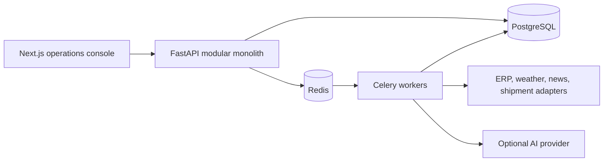
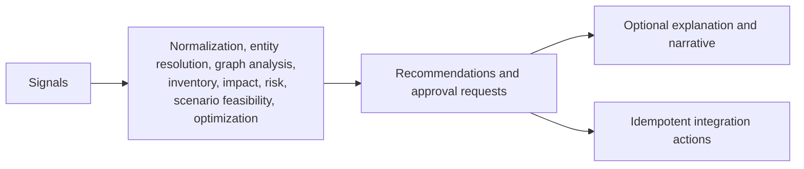

# Architecture

## Target architecture

The product starts as a Python modular monolith with a separately deployed Next.js client. PostgreSQL is the system of record; Redis supports asynchronous work and Celery task dispatch. Connectors and AI providers are replaceable adapters behind explicit interfaces.

## Decision boundary

Numerical business claims originate only from structured records and deterministic calculations. AI outputs are never authoritative for inventory, revenue, risk, feasibility, or optimization values.

## Initial service boundaries

- `api`: HTTP, authentication boundary, RBAC, response envelopes, and orchestration entry points.
- `domain`: supply-chain entities, calculation services, workflow engine, policies, and audit events.
- `infrastructure`: database repositories, connectors, Celery tasks, AI adapters, and observability.
- `frontend`: operational UI consuming aggregation and resource APIs.

This layout stays within one backend deployable until real operational needs justify extracting a service.
