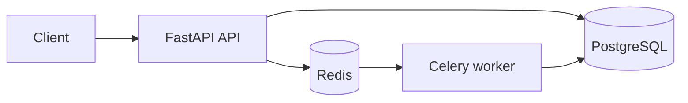

# Backend foundation

## Runtime topology

The backend is one FastAPI modular monolith plus Celery worker processes built from the same source. PostgreSQL is the durable store and Redis supplies the Celery broker/result backend and future short-lived coordination needs.

## Package boundaries

- `app.api`: transport contracts, versioned routers, and dependency injection.
- `app.core`: validated settings, logging, middleware, and errors.
- `app.domain`: SQLAlchemy base and, from Phase 2 onward, domain entities and deterministic services.
- `app.infrastructure`: database sessions, Redis, health checks, and later external adapters.
- `app.worker`: Celery application and safety defaults.

HTTP controllers will translate requests and delegate work; they will not contain business workflow logic.

## Operational endpoints

| Endpoint | Purpose | External dependencies |
| --- | --- | --- |
| `GET /api/v1/health/live` | Confirms the process can serve HTTP | None |
| `GET /api/v1/health/ready` | Confirms the process can perform useful work | PostgreSQL and Redis |

Every HTTP response carries `X-Request-ID`. Structured request logs include the same ID, method, path, status, and duration. Later workflow execution adds `workflow_run_id` and `stage_run_id` to this context.

## Database lifecycle

Alembic reads the same `DATABASE_URL` setting as the API. Phase 1 establishes an empty baseline revision; Phase 2 adds canonical domain tables. The naming convention on SQLAlchemy metadata ensures generated constraint names remain stable.

## Error contract

Expected, validation, HTTP, and unexpected errors use a consistent envelope. Unexpected failures are logged with their stack trace but returned to callers as a generic message. Request inputs and connection details are not written into error responses.
