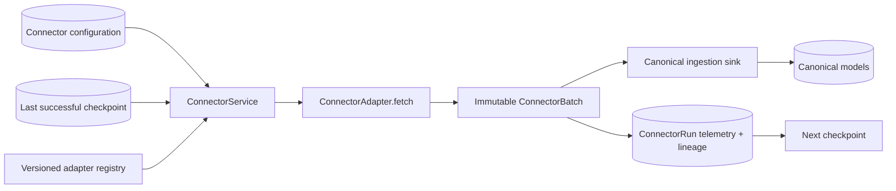

# Connector framework

Phase 5 provides a replaceable, checkpointed integration boundary for ERP, weather, news, shipment tracking, and supplier feeds. The application runs completely offline with deterministic mock adapters, while the same contracts can support real providers later.

## Runtime flow

`ConnectorService` resolves an adapter using the persisted `<key>@<version>` reference. It creates a durable run, supplies the last successful checkpoint, fetches one batch, passes records to a caller-selected canonical sink, and records the outcome. A failed batch never advances the checkpoint.

## Contracts

- `ConnectorAdapter.fetch(context)` returns one `ConnectorBatch` and performs no database writes.
- `ConnectorRecord` carries external identity, record type, timezone-aware observation time, raw payload, source URI, and safe metadata.
- `ConnectorSink.write(context, records)` is the boundary that maps raw records into canonical application models.
- `ConnectorBatch` rejects duplicate external IDs and carries the next checkpoint plus batch metadata.
- `ConnectorRegistry` selects an exact adapter key and implementation version; duplicate registration is rejected.

The framework deliberately separates transport from normalization. Phase 5 proves source retrieval and telemetry. The Phase 6 signal sink normalizes supported records, resolves entities, and persists canonical `ExternalSignal` and incident data without coupling those rules to provider clients.

## Lineage and safety

Each successful `ConnectorRun` records:

- exact adapter key and version;
- previous and next checkpoints;
- batch metadata and record counts;
- external record ID and canonical record type;
- observed time and source URI;
- SHA-256 of the canonical raw payload;
- adapter-supplied non-secret metadata.

Run lineage does not duplicate raw payloads and never stores connector configuration or secret references. Raw values remain on the record passed to the canonical sink. Failures persist a bounded error type/message, mark the connector `ERROR`, and retain the last successful checkpoint for a safe retry.

Connector configuration may contain a secret reference, but adapter contexts receive only the non-secret JSON configuration. A future secret provider resolves credentials at the infrastructure boundary; credentials must never appear in configuration JSON, logs, lineage, or exception responses.

## Offline mock adapters

| Persisted reference | Records | Demonstration purpose |
| --- | ---: | --- |
| `mock.erp@1.0` | 3 | Inventory and purchase-order facts |
| `mock.weather@1.0` | 2 | Taiwan typhoon and wind observation |
| `mock.news@1.0` | 2 | Singapore port closure and low-confidence supplier rumor |
| `mock.shipment@1.0` | 3 | Multiple delayed shipments through Singapore |
| `mock.supplier@1.0` | 2 | Kyoto shutdown and Formosa capacity update |

The Nova seed creates all five connector configurations in `MOCK_MODE`. Re-running the seed remains idempotent.
