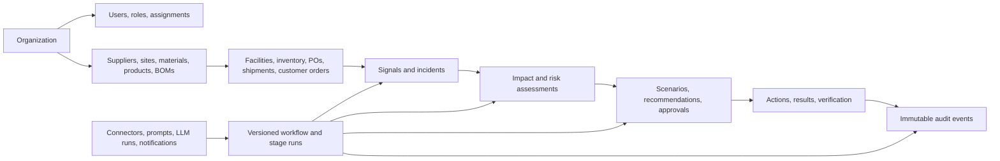

# Canonical data model

Phase 2 establishes 53 PostgreSQL tables. Models are grouped in source for maintainability but remain part of one transactional schema and one modular-monolith deployment.

## Domain topology

## Major model groups

| Group | Canonical models |
| --- | --- |
| Identity | Organization, User, Role, UserRole |
| Supply network | Supplier, SupplierSite, SupplierRating, Material, MaterialSupplier, Product, BillOfMaterial, BOMComponent |
| Facilities and inventory | Facility with Plant/Warehouse/DistributionCenter specializations, InventorySnapshot, ConsumptionHistory |
| Procurement and logistics | PurchaseOrder, PurchaseOrderLine, Shipment, ShipmentEvent |
| Demand | Customer, CustomerOrder, CustomerOrderLine |
| Disruption intelligence | SignalSource, ExternalSignal, DisruptionIncident, IncidentSignal, IncidentEntity |
| Deterministic decisions | ImpactAssessment, ImpactMetric, RiskAssessment, RiskFactor, Scenario, ScenarioAction, Recommendation |
| Human control and execution | ApprovalRequest, ApprovalDecision, ExecutionAction, ExecutionResult, VerificationResult |
| Workflow | WorkflowDefinition, WorkflowVersion, StageDefinition, StageConfiguration, StageDependency, WorkflowRun, StageRun |
| Platform | PromptTemplate, LLMModelConfiguration, LLMRun, Connector, ConnectorRun, Notification, AuditLog |

## Tenant isolation

`Organization` is the root tenant. Every other business table inherits `TenantEntity` and therefore has a required, indexed `organization_id` foreign key. Application data access requires an explicit immutable `TenantContext`; `TenantRepository` applies the organization predicate to every read and rejects cross-tenant inserts and deletes.

Authentication will construct the tenant context from the verified identity rather than from a client-supplied organization header. Domain services must validate referenced entities through repositories in the same context before creating cross-entity links.

## Traceability and explainability

- Raw connector and signal payloads are preserved separately from normalized data.
- Impact metrics and risk factors store calculation lineage.
- Incidents and workflow runs retain the exact workflow version.
- Scenario inputs, constraints, assumptions, and deterministic outputs are persisted.
- AI runs retain provider/model/prompt version and telemetry, but no authoritative numeric calculation is delegated to AI.
- Execution actions have tenant-unique idempotency keys.
- Audit events retain before/after values plus request, workflow-run, and workflow-version references.

## Multi-level BOM representation

A BOM component references exactly one material or component product. Product-to-product component links permit arbitrary BOM depth. Circular-dependency prevention and traversal belong to the deterministic graph service in Phase 7; the database constraint prevents ambiguous component rows today.

## Migration

Alembic revision `46e6e8f4af02` is a frozen, explicit migration from the Phase 1 baseline. It creates and drops all 53 tables and associated constraints/indexes without importing mutable runtime model definitions.
