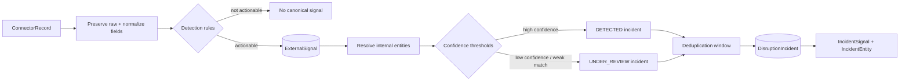
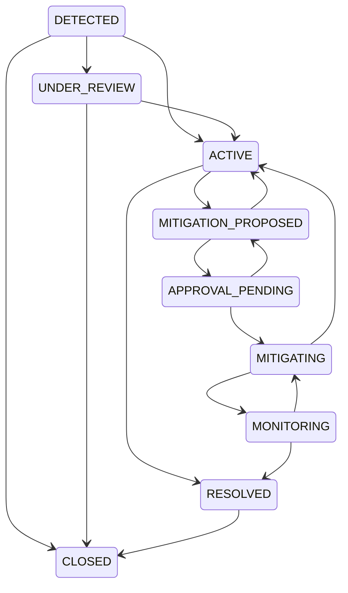

# Signal and incident intelligence

Phase 6 converts checkpointed connector records into canonical signals and safely groups them into disruption incidents. Classification, thresholding, entity matching, deduplication, and lifecycle transitions are deterministic. No LLM participates in these decisions.

## Processing flow

`SignalIngestionSink` implements the connector sink contract from Phase 5. The connector identifies a configured `SignalSource`; the service loads that source's editable thresholds, detects supported records, and returns the number of new canonical signals written. Replayed external IDs are idempotently ignored.

## Normalization and raw preservation

The normalizer standardizes:

- supplier, site, material, and facility identifiers;
- country names and ISO-like country codes;
- common unit aliases such as pieces/each to `EA`;
- whitespace, dates, and timezone handling;
- numeric inputs used by deterministic thresholds.

`ExternalSignal.raw_payload` preserves the source values. `normalized_payload` stores the canonical form. Source lineage identifies the connector, connector run, external ID, source URI, observation time, and payload hash.

## Detection rules

| Raw record type | Canonical signal |
| --- | --- |
| Weather event/observation | `WEATHER_DISRUPTION` |
| News event | Explicit supported category |
| Shipment delay | `PORT_CLOSURE` or `TRANSPORT_DISRUPTION` |
| Supplier event | `SUPPLIER_SHUTDOWN` or `SUPPLIER_DELAY` |
| Supplier capacity | `CAPACITY_PROBLEM` when utilization crosses its threshold |
| Inventory snapshot | `INVENTORY_ANOMALY` when on-hand crosses its threshold |
| Late purchase order | `LATE_PURCHASE_ORDER` |
| Manual disruption | Explicit category or `MANUAL_DISRUPTION` |

Unsupported or below-threshold records remain connector telemetry and do not become signals.

## Entity resolution

References may target suppliers, supplier sites, materials, facilities, and shipments. Resolution first compares normalized exact code/name/location aliases, then uses deterministic string similarity. Every result stores:

- entity type and internal ID;
- match confidence;
- exact/fuzzy method and matched field;
- whether human review is required.

Multiple entities can match the same location—for example two supplier sites in one city. Matches below the minimum are omitted. Matches between the configured match and review thresholds are retained but force the incident into `UNDER_REVIEW`.

## Deduplication

The deduplication identity is a SHA-256-derived key over signal category, canonical location, and category-relevant entities. The configurable time window defaults to 72 hours.

- Weather and port/transport events group primarily by location, allowing several source or shipment signals to describe one disruption.
- Supplier events group by resolved supplier, falling back to site when a supplier is unavailable.
- Inventory anomalies include material and facility.
- Resolved and closed incidents are never reopened by deduplication; a later signal creates a new incident.

Additional signals can raise incident severity and confidence but do not silently clear an existing review requirement.

## Confidence safety

Two thresholds separate data retention from autonomous progression:

- `minimum_signal_confidence`: below this, the record does not become a signal.
- `auto_incident_confidence`: below this, the incident is created as `UNDER_REVIEW`.

An unresolved entity reference also requires review. The seeded low-confidence Kyoto rumor therefore remains review-gated even if later corroboration increases the incident's numeric confidence; a human or explicit review stage must advance it.

## Lifecycle

The service enforces the allowed status graph:

Invalid skips and reactivation of closed incidents return a stable conflict error. Transitioning to `RESOLVED` records the resolution time.

## Editable configuration

Each `SignalSource.configuration` stores the current values for minimum signal confidence, automatic incident confidence, entity match/review thresholds, deduplication hours, capacity utilization, and inventory on-hand thresholds. The Nova seed creates five source configurations matching its five mock connectors. Phase 6 adds these to the dataset, bringing the current seed to 902 records.
