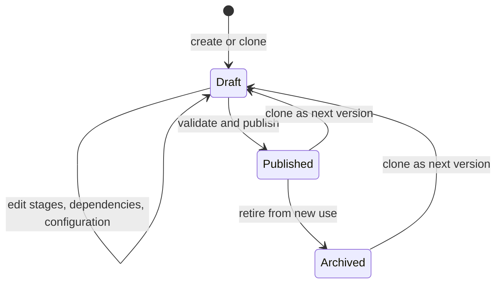
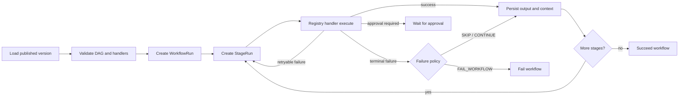

# Workflow engine

Phase 4 establishes the configurable workflow runtime. PostgreSQL stores definitions, immutable published versions, stages, configuration, dependencies, workflow runs, and stage runs. Python handlers contain executable business behavior, while the database controls which versioned handlers and settings compose a workflow.

## Authoring lifecycle



Published version content is never edited in place. `WorkflowService` rejects changes to stages, configurations, and dependencies unless the parent version is `DRAFT`. Editing a published workflow therefore means cloning it, receiving the next version number, changing the new draft, validating it, and publishing it.

Each clone deep-copies:

- stage definitions and JSON schemas;
- stage configuration, retry, timeout, failure, approval, and AI settings;
- dependency edges and conditions.

Runs retain `workflow_version_id`, so historical and replayed decisions always identify the exact configuration used.

## Stage contract and registry

Every stage handler exposes a stable `key` and `version` and implements:

```python
async def execute(
    context: StageExecutionContext,
    config: Mapping[str, object],
) -> StageResult:
    ...
```

The persisted `StageDefinition.handler` and `handler_version` resolve through `StageRegistry`. Publication fails if any enabled stage references an unavailable handler. Duplicate registrations are rejected, which prevents deployment order from silently changing behavior.

`StageExecutionContext` contains organization, workflow-run, and stage-run identifiers plus accumulated structured values. A successful `StageResult` records stage output and may add explicit values to the context passed to downstream stages. It may instead return `WAITING_FOR_APPROVAL`; arbitrary status changes are not accepted.

## DAG validation

The validator builds a directed graph with NetworkX and rejects a version when:

- it has no stages or no enabled stages;
- stage IDs, keys, or positions are duplicated;
- a dependency points outside the version;
- a stage depends on itself;
- an edge is duplicated;
- an enabled stage depends on a disabled stage;
- the graph contains a cycle;
- an enabled stage references an unregistered handler.

Valid graphs receive a deterministic topological order. Position is the stable tie-breaker for parallel branches; runtime execution remains sequential in Phase 4. Later Celery orchestration can parallelize independent branches without changing the persisted graph contract.

## Runtime behavior



Only published versions execute. Before creating a run, the engine validates the graph, configurations, handler availability, timeouts, and retry bounds. Each attempt updates the durable `StageRun`; failures retain a safe error type and bounded message. `WorkflowRun.context` is replaced after every completed stage so JSON changes are tracked by SQLAlchemy.

Current retry support is bounded to 1–10 attempts. `FAIL_WORKFLOW`, `SKIP_STAGE`, and `CONTINUE` policies are honored. Queue dispatch, resumption after approval, and conditional edge evaluation will be added as the corresponding workflow stages become functional; the persisted contracts already support them.

## Tenant boundary

`WorkflowRepository`, `WorkflowService`, and `WorkflowEngine` all require the same immutable `TenantContext`. Every aggregate query includes `organization_id`, every new entity is stamped with the active organization, and cross-tenant IDs resolve as not found. This is the same isolation rule used by the rest of the domain model.
